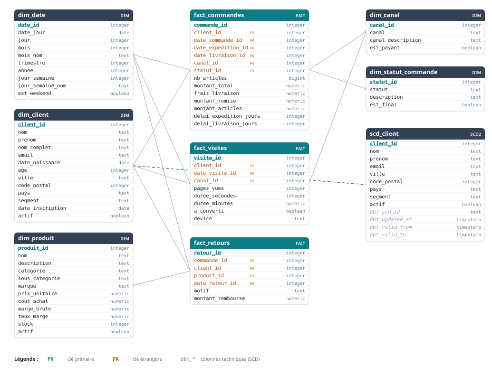

<div class="cover">
<div class="bar"></div>
<div class="kicker">Rapport professionnel · Livrable E6</div>
<h1>Maintenance d'un entrepôt de données</h1>
<div class="subtitle">VenteRapide, entrepôt PostgreSQL et dbt (schéma en étoile de Kimball)</div>
<div class="meta">
<p><b>Auteur</b> Anice GUIREN</p>
<p><b>Certification</b> Data Engineer (RNCP 37638), compétences C16 et C17</p>
<p><b>Contexte</b> Data engineer junior chez ShopFlow, pour le client VenteRapide</p>
<p><b>Date</b> Septembre 2026</p>
</div>
<div class="foot">Ce rapport retrace la mise en conditions opérationnelles de l'entrepôt de VenteRapide, de la compréhension de l'existant jusqu'à sa documentation, en passant par ses évolutions et son exploitation au quotidien.</div>
</div>

::: toc
**Sommaire**

1. [Introduction et contexte](#s1)
2. [Comprendre l'entrepôt existant](#s2)
3. [Intégrer une nouvelle source de données](#s3)
4. [Gérer les variations de dimensions (SCD)](#s4)
5. [Organiser la maintenance](#s5)
6. [Journaliser l'activité et alerter](#s6)
7. [Sauvegarder et restaurer](#s7)
8. [Gérer les accès et respecter le RGPD](#s8)
9. [Documenter et préparer la montée en charge](#s9)
10. [Les modèles logique et physique](#s10)
11. [Passage en production, ce qui changerait](#s11)
12. [Conclusion et retour d'expérience](#s12)

[Annexes](#annexes)
:::

# 1. Introduction et contexte {#s1}

VenteRapide est une boutique en ligne généraliste présente sur le marché français depuis 2021. L'entreprise dispose déjà d'un entrepôt de données opérationnel qui rassemble au même endroit ses commandes, ses produits, ses clients et les visites de son site. Chaque jour, l'équipe analytique s'appuie sur cet entrepôt pour produire ses reportings. En tant que data engineer junior chez ShopFlow, l'entreprise de services qui accompagne VenteRapide, ma mission n'est donc pas de construire cet entrepôt mais de le maintenir et de le faire évoluer en conditions opérationnelles.

Le maintien en conditions opérationnelles signifie qu'un système déjà en production doit continuer à fonctionner de façon fiable dans la durée. Concrètement, quelqu'un doit surveiller son activité, sauvegarder ses données, gérer les droits d'accès, intégrer les nouvelles sources et faire évoluer sa structure sans jamais le casser. C'est ce que recouvrent les deux compétences évaluées, la C16 pour l'exploitation et la maintenance au sens large, la C17 pour la gestion des variations dans les dimensions.

Le rapport suit le déroulé réel du projet. Il commence par la compréhension de l'entrepôt existant, car on ne modifie pas un système sans l'avoir compris, présente ensuite les deux évolutions apportées, décrit l'exploitation au quotidien en sécurité, puis termine par la documentation et les modèles de données à jour. Les captures qui prouvent chaque résultat sont regroupées en annexe, et le texte y renvoie par des liens cliquables.

# 2. Comprendre l'entrepôt existant {#s2}

## La pile technique

L'entrepôt repose sur un ensemble d'outils, rappelés ici car ils reviennent tout au long du rapport.

| Élément | Technologie | Rôle |
|---|---|---|
| Base de données | PostgreSQL 16 | stocke et sert les données |
| Transformation (ETL) | dbt 1.11 | construit les modèles en SQL |
| Modélisation | schéma en étoile (Kimball) | organise les faits et les dimensions |
| Planification et exploitation | cron, bash, msmtp | automatise les tâches et les alertes |
| Versioning | Git | historise le code |
| Environnement | Linux (Ubuntu 24.04) | héberge l'ensemble |

## Un entrepôt organisé en couches successives

Le point le plus important à saisir est que dbt ne mélange pas tout. Il fait circuler la donnée à travers des couches qui ont chacune un rôle défini, et c'est cette organisation qui rend l'entrepôt lisible et fiable.

La première couche est constituée des seeds. Ce sont les fichiers CSV bruts, chargés tels quels dans des tables préfixées par `raw_`. À ce stade rien n'est transformé, ce qui garantit une traçabilité complète de la donnée d'origine. La deuxième couche est le staging. Pour chaque source, une vue préfixée par `stg_` nettoie et type la donnée, par exemple en convertissant une date stockée en texte vers une vraie date. Cette couche joue le rôle de sas de qualité. La troisième couche contient le cœur analytique, avec les dimensions qui décrivent le contexte, comme `dim_client` ou `dim_produit`, et les faits qui contiennent les événements chiffrés, comme `fact_commandes`. Cette organisation de faits entourés de dimensions est précisément le schéma en étoile, détaillé dans la partie 10. Enfin, un snapshot nommé `scd_client` conserve l'historique des changements du client, dont le fonctionnement est expliqué dans la partie 4.

## Remettre l'environnement en route

Avant toute intervention, j'ai vérifié que l'entrepôt fonctionnait réellement en installant PostgreSQL et dbt puis en lançant la construction complète du projet avec la commande `dbt build`, qui enchaîne le chargement des seeds, la construction des modèles, le snapshot et l'exécution des tests. La base tournant en parallèle d'un autre service sur le port habituel, l'instance du projet a simplement été configurée sur un autre port, ce qui a suffi à établir la connexion. La construction s'est ensuite déroulée sans erreur et l'ensemble des tests est passé au vert, ce qui me donnait un point de départ sain avant de faire évoluer quoi que ce soit. La preuve de cette mise en route figure en [annexe A](#annexe-a).

# 3. Intégrer une nouvelle source de données {#s3}

## Le besoin métier

VenteRapide souhaite analyser les retours de produits afin de comprendre quels articles sont le plus souvent renvoyés et pour quel motif. Cette information existait dans un fichier `raw_retours.csv` mais restait en dehors de l'entrepôt, donc inexploitable par les analystes. Mon travail a consisté à l'y intégrer proprement.

## Faire passer la donnée par les mêmes couches

Le principe de la maintenance est de ne jamais bricoler une solution parallèle. J'ai donc fait entrer les retours par le même chemin que le reste des données, avec les trois commandes suivantes.

```bash
dbt seed --select raw_retours              # crée la table brute raw_retours
dbt run  --select stg_retours fact_retours # nettoie puis construit le fait
dbt test --select stg_retours fact_retours # exécute les tests associés
```

La première commande charge le fichier comme un nouveau seed. La deuxième construit la vue de staging `stg_retours`, qui type notamment la date du retour et le montant remboursé, puis la table de faits `fact_retours`. Le choix de modélisation de cette table mérite d'être expliqué. Sa granularité est d'une ligne par retour. Le fait ne recopie pas les informations du client ou du produit, il se contente de porter les clés vers les dimensions déjà existantes, à savoir `dim_client`, `dim_produit` et `dim_date`. On appelle cela réutiliser des dimensions conformes, et c'est la bonne pratique, car cela garantit qu'un client signifie la même chose dans toutes les analyses. La référence à la commande est conservée dans le fait, le motif du retour reste un attribut, et le montant remboursé constitue la mesure que l'on pourra agréger.

## Garantir l'intégrité par les tests

Chaque nouveau modèle a été accompagné de tests. Les plus importants sont les tests de relation, qui vérifient que chaque clé étrangère du fait pointe bien vers une valeur existante dans sa dimension. Autrement dit, ils garantissent qu'aucun retour ne fait référence à un client ou à un produit fantôme. La construction complète de l'entrepôt s'est terminée avec cent huit opérations réussies et aucune erreur, et l'analyse des retours est désormais possible, comme le montre l'[annexe B](#annexe-b).

Cette étape a réservé une difficulté parlante. Un des motifs possibles est la valeur `Changement d'avis`, qui contient une apostrophe. Or le test qui vérifie la liste des valeurs autorisées entoure chaque valeur de guillemets simples en SQL. L'apostrophe interne cassait donc la requête et faisait échouer le test. La correction consiste à doubler l'apostrophe, ce qui est la manière normale d'échapper ce caractère en SQL. Au delà de l'anecdote, cet incident illustre l'intérêt des tests, puisqu'ils ont intercepté une erreur avant qu'elle n'atteigne la production.

# 4. Gérer les variations de dimensions, les SCD (C17) {#s4}

## Le problème posé par le temps

Cette partie répond à la compétence C17. Le problème est simple à énoncer. Les attributs d'une dimension changent au fil du temps. Un client déménage, un produit change de prix. La question centrale, formalisée par Ralph Kimball, est de savoir ce que l'on fait de l'ancienne valeur quand la nouvelle arrive. Selon la réponse, on parle de dimension à variation lente de type 1, 2 ou 3.

| Type | Comportement au changement | Historique conservé | Exemple dans le projet |
|---|---|---|---|
| Type 1 | la nouvelle valeur écrase l'ancienne | aucun | le prix dans `dim_produit` |
| Type 2 | une nouvelle ligne est créée, l'ancienne est fermée par des dates de validité | complet | la ville et le segment dans `scd_client` |
| Type 3 | l'ancienne valeur est gardée dans une colonne dédiée | partiel, un seul niveau | non utilisé ici |

Le bon choix dépend du besoin. On retient le type 2 quand l'historique a une vraie valeur pour l'analyse, et le type 1 quand seule la valeur actuelle compte.

## Le type 2 sur le client

L'entrepôt historise déjà le client grâce au snapshot `scd_client`, qui surveille les colonnes de ville, de code postal et de segment. Quand l'une d'elles change, dbt ferme l'ancienne version en lui donnant une date de fin, puis ouvre une nouvelle version. Pour le démontrer, j'ai simulé un déménagement du client numéro 1 de Bordeaux vers Paris, puis relancé le snapshot. Le client possède alors deux lignes, la version Bordeaux archivée avec une date de fin renseignée, et la version Paris courante dont la date de fin est vide. Cette historisation est visible en [annexe C](#annexe-c).

L'intérêt réel du type 2 apparaît quand on veut retrouver l'état du client au moment d'un événement passé. J'ai écrit pour cela une requête qui joint les commandes et le snapshot en s'appuyant sur les bornes de validité. Elle rattache chaque commande à la version du client dont l'intervalle de validité contient la date de la commande. On constate ainsi que les commandes de 2023 de ce client ressortent avec Bordeaux, la ville où il habitait alors, et non avec Paris, sa ville actuelle. Sans le type 2, on réécrirait l'histoire à chaque changement et les rapports passés deviendraient faux. Le résultat de cette requête figure en [annexe C](#annexe-c).

## Le type 1 sur le produit

Le cas du prix est différent, car on ne cherche pas à conserver l'ancien tarif, seule la valeur courante nous intéresse. La table `dim_produit` étant reconstruite entièrement à chaque exécution de dbt, elle réalise nativement un comportement de type 1. Je l'ai vérifié en modifiant le prix d'un produit dans la source. Après reconstruction, la table porte le nouveau prix, la marge est recalculée, et il n'existe toujours qu'une seule ligne pour ce produit, sans aucune trace de l'ancien tarif, comme le montre l'[annexe C](#annexe-c).

Un enseignement important de cette partie est qu'aucune modification du code de transformation n'a été nécessaire pour gérer ces deux variations. Le snapshot assure de lui-même le type 2 et la table assure de lui-même le type 1. Les variations s'intègrent donc sans dénaturer le schéma en étoile initial, ce qui répond directement à l'exigence de la compétence C17.

# 5. Organiser la maintenance {#s5}

Une fois l'entrepôt enrichi, il faut l'exploiter dans la durée de façon organisée. Cette partie pose le cadre des suivantes.

## La méthodologie retenue

Je me suis appuyé sur trois approches complémentaires. La première est le référentiel ITIL, qui structure la gestion d'un service informatique en cinq étapes, la stratégie des services, leur conception, leur transition, leur exploitation et l'amélioration continue. J'en retiens surtout la distinction entre la gestion des incidents, qui vise à rétablir le service au plus vite, et la gestion des problèmes, qui traite la cause profonde pour éviter la récidive. La deuxième approche est le ticketing, qui trace chaque demande ou incident sous la forme d'un ticket doté d'une priorité, d'un responsable et d'un statut. La troisième est la méthode Kanban, issue des méthodes agiles, qui rend le flux de travail visible sur un tableau allant de la colonne à faire jusqu'à la colonne terminé, en limitant le nombre de tâches menées en parallèle.

## La priorisation et la répartition

Les tâches sont classées selon une matrice qui croise leur impact et leur urgence, ce qui donne quatre niveaux de priorité. Le délai indiqué est celui de la prise en charge, c'est-à-dire le moment où quelqu'un commence à traiter le ticket.

| Priorité | Situation | Exemple concret | Délai de prise en charge |
|---|---|---|---|
| P1 critique | service indisponible ou données corrompues | entrepôt injoignable, sauvegarde échouée | moins d'une heure |
| P2 majeur | fonction dégradée mais contournable | construction dbt nocturne en échec | moins de deux heures |
| P3 mineur | gêne sans blocage | requête lente, documentation à mettre à jour | moins d'un jour ouvré |
| P4 mineur non urgent | amélioration ou dette technique | renommage d'un modèle | moins d'une semaine |

Chaque type de tâche est confié à un rôle précis. Le data engineer prend en charge les modèles et les tests dbt. L'administrateur de la base s'occupe des sauvegardes, des accès et du stockage. Le référent chargé des données personnelles suit le registre et les purges. L'analyste remonte les anomalies qu'il constate. Un incident critique déclenche l'intervention conjointe du data engineer et de l'administrateur.

## Les indicateurs de service et leur intérêt

Prendre un ticket en charge rapidement ne suffit pas, encore faut-il mesurer la qualité réelle du service rendu. C'est le rôle des indicateurs de service, chacun associé à une cible que l'on s'engage à tenir, ce que l'on appelle un accord de niveau de service ou SLA. Ces indicateurs mesurent la résolution complète et la santé générale de l'entrepôt, et non plus seulement le démarrage du traitement. Par exemple, le délai moyen de résolution d'un incident critique est plus long que son délai de prise en charge, puisqu'il couvre le diagnostic et la correction. Regroupés dans un tableau de bord, ces indicateurs permettent au responsable de voir d'un seul coup d'œil si les engagements sont tenus et de repérer immédiatement toute dérive.

| Indicateur | Cible visée | Valeur d'exemple | État |
|---|---|---|---|
| Disponibilité mensuelle de l'entrepôt | au moins 99,5 % | 99,8 % | conforme |
| Délai moyen de résolution d'un incident critique | moins de 4 heures | 1 heure 20 | conforme |
| Fraîcheur des données | moins de 24 heures | 6 heures | conforme |
| Taux de réussite des constructions dbt | au moins 99 % | 100 % | conforme |
| Taux de réussite des sauvegardes sur sept jours | 100 % | 100 % | conforme |
| Tests dbt au vert | 100 % | 87 sur 87 | conforme |

En production, ce tableau de bord serait alimenté automatiquement à partir des journaux de la base, du fichier de résultats produit par dbt et de l'outil de ticketing, à l'aide d'un outil de visualisation comme Grafana ou Metabase.

# 6. Journaliser l'activité et alerter {#s6}

Surveiller l'entrepôt revient à répondre à deux questions. La première est de savoir ce qui s'est passé, ce qui suppose de conserver des journaux. La seconde est de savoir comment être prévenu quand quelque chose se casse, ce qui suppose une alerte active. J'ai traité ces deux besoins à deux endroits, la base de données et le pipeline dbt.

## La journalisation de PostgreSQL

PostgreSQL classe chaque événement selon un niveau de gravité, du plus bavard au plus grave. Pour catégoriser au minimum les alertes et les erreurs, j'ai ajouté un petit fichier de configuration, inclus automatiquement par la base, contenant les réglages suivants.

```conf
log_min_messages = warning        # journalise les alertes (WARNING) et au dessus
log_min_error_statement = error   # ajoute la requête responsable de chaque erreur
log_connections = on              # trace les connexions à la base
```

J'ai ensuite appliqué ces réglages par un simple rechargement à chaud, sans redémarrer la base, ce qui évite toute coupure de service.

```bash
sudo systemctl reload postgresql@16-main
```

À partir de là, chaque ligne du journal porte son niveau de gravité, ce qui permet de retrouver très simplement les alertes et les erreurs en filtrant le fichier de journal.

```bash
grep -E "WARNING:|ERROR:" /var/log/postgresql/postgresql-16-main.log
```

Pour vérifier le bon fonctionnement, j'ai provoqué volontairement une alerte puis une erreur, et je les ai retrouvées dans le journal, correctement catégorisées et accompagnées de la requête fautive, comme le montre l'[annexe E](#annexe-e).

## Le monitoring de dbt et l'alerte par courriel

La journalisation de la base décrit ce qui se passe dans la base. Il fallait aussi surveiller la reconstruction de l'entrepôt et être prévenu en cas d'échec. J'ai écrit pour cela un script qui lance la construction dbt et examine son code de sortie, c'est-à-dire le nombre que renvoie tout programme pour indiquer s'il a réussi. Un code de zéro signifie que tout s'est bien passé et le script reste silencieux. Un code différent de zéro signifie un échec et déclenche alors l'envoi d'un courriel d'alerte contenant les dernières lignes du journal, afin de comprendre immédiatement l'origine du problème. L'envoi passe par un service de messagerie classique à l'aide d'un utilitaire dédié, dont les identifiants sont rangés dans un fichier protégé et jamais écrits dans le script. J'ai testé le dispositif en provoquant un échec réel de la construction, ce qui a bien déclenché la réception du courriel, visible en [annexe E](#annexe-e).

# 7. Sauvegarder et restaurer {#s7}

Un entrepôt en production doit pouvoir être restauré en cas d'incident, qu'il s'agisse d'une corruption, d'une fausse manipulation ou d'une panne de disque. La règle d'or du métier est qu'une sauvegarde qui n'a jamais été testée ne vaut rien.

## La stratégie de sauvegarde

J'ai mis en place une sauvegarde logique à l'aide de l'outil `pg_dump`, qui produit un fichier contenant à la fois la structure des tables et l'intégralité des données. Ce point est important à comprendre, car en ouvrant le fichier on y voit surtout des ordres de création de tables, mais les données sont bien présentes juste après, sous forme de lignes à recharger. Perdre la base ne perd donc rien tant que l'on possède ce fichier.

```bash
pg_dump -Fc -f dw_full_$(date +%F).dump datawarehouse_e6
```

J'ai défini deux niveaux de sauvegarde. La sauvegarde complète porte sur toute la base, s'exécute chaque nuit et est conservée quatorze jours. La sauvegarde partielle porte uniquement sur les tables de faits, qui sont les plus volatiles, s'exécute toutes les six heures et est conservée trois jours. Ce découpage limite la perte de données possible entre deux sauvegardes complètes. Ces deux tâches sont planifiées avec cron, l'ordonnanceur de Linux, qui les exécute automatiquement même lorsque aucune session n'est ouverte.

```cron
0 2 * * *   backup.sh full      # sauvegarde complète chaque nuit à 2 heures
0 */6 * * * backup.sh partial    # sauvegarde partielle toutes les 6 heures
```

Les identifiants nécessaires sont rangés dans un fichier de mots de passe dédié, ce qui évite d'écrire le moindre secret dans les scripts ou dans la planification.

## Le test de restauration

Surtout, j'ai réellement testé la restauration, car c'est la seule preuve valable. Le test restaure la dernière sauvegarde complète dans une base jetable, compte les lignes récupérées pour vérifier que le contenu est bien présent, puis supprime cette base de test. Le résultat, avec le décompte exact des lignes restaurées, figure en [annexe D](#annexe-d).

# 8. Gérer les accès et respecter le RGPD {#s8}

Cette partie comporte une action technique et plusieurs livrables de conformité, car la gestion des accès touche directement à la protection des données personnelles.

## Un accès en lecture seule selon le moindre privilège

Le principe du moindre privilège consiste à n'accorder que les droits strictement nécessaires. L'équipe analytique a besoin de lire l'entrepôt, mais jamais de le modifier. J'ai donc créé un rôle nommé `reporting` disposant uniquement du droit de lecture et d'aucun droit d'administration.

```sql
GRANT SELECT ON ALL TABLES IN SCHEMA public TO reporting;
ALTER DEFAULT PRIVILEGES IN SCHEMA public GRANT SELECT ON TABLES TO reporting;
```

La seconde ligne est importante, car elle accorde aussi la lecture sur les tables qui seront créées plus tard, sans quoi chaque nouveau modèle serait invisible pour ce rôle. J'ai ensuite vérifié le rôle de deux manières complémentaires, ce qui est la preuve attendue. En positif, une requête de lecture fonctionne. En négatif, toute tentative d'écriture est refusée. Ces deux vérifications sont visibles en [annexe F](#annexe-f).

## La stratégie d'accès et le registre des traitements

La stratégie retenue repose sur des accès nominatifs limités au besoin réel, sur la traçabilité des connexions assurée par la journalisation, et sur la minimisation des données exposées. Lorsqu'un usage n'a pas besoin des colonnes identifiantes comme le nom ou le courriel, il vaut mieux exposer une vue restreinte plutôt que la table entière. Le règlement impose par ailleurs de tenir un registre des traitements de données personnelles, que j'ai rédigé et dont voici le contenu.

| Traitement | Finalité | Données concernées | Base légale | Conservation | Destinataires |
|---|---|---|---|---|---|
| Gestion des commandes | exécuter et suivre les commandes | identité, courriel, adresse, montants | exécution du contrat | 5 ans | logistique, comptabilité |
| Gestion des retours | traiter les remboursements | client, produit, montant | exécution du contrat | 5 ans | service après-vente, comptabilité |
| Analyse des visites | mesurer l'audience du site | client, appareil, pages vues | intérêt légitime | 13 mois | équipe analytique |
| Reporting analytique | piloter l'activité | agrégats et référence client | intérêt légitime | durée de vie du compte | équipe reporting |
| Historisation du client | connaître l'état du client au moment des faits | identité, ville, segment | intérêt légitime | 5 ans | équipe analytique |

## La procédure de tri et de purge

J'ai enfin rédigé une procédure d'anonymisation des clients inactifs. Le critère retenu est l'absence de commande depuis trente-six mois. Les champs identifiants de ces clients sont alors remplacés par des valeurs neutres, tout en conservant leur identifiant technique afin de ne pas casser les analyses agrégées. Cette anonymisation est irréversible, ce qui la distingue d'une simple pseudonymisation, et elle est prévue pour s'exécuter automatiquement chaque mois. Un point important est que cette purge doit viser la source des données, car l'entrepôt est reconstruit à partir de cette source à chaque exécution. Un essai à blanc a permis d'identifier dix-sept clients concernés sans rien modifier, comme le montre l'[annexe F](#annexe-f).

# 9. Documenter et préparer la montée en charge {#s9}

La documentation prépare l'avenir de l'entrepôt. J'ai produit un ensemble de procédures organisées par cas d'usage, afin qu'un tiers puisse comprendre et reproduire chaque opération courante. Elles couvrent la création d'un accès dans le fichier `procedure_ajout_acces.md`, l'augmentation de l'espace de stockage et de la capacité de calcul dans `procedure_stockage.md`, et l'ajout d'un nouveau datamart dans `procedure_datamart.md`. Le volet conformité est détaillé dans `rgpd_registre_et_purge.md`, et l'organisation de la maintenance dans `organisation_maintenance.md`.

Le terme datamart mérite une explication. Il s'agit d'un sous-ensemble thématique de l'entrepôt, dédié à une équipe précise comme le marketing, qui expose des tables déjà agrégées et prêtes à l'emploi. Il se construit au-dessus des faits et des dimensions existants et réutilise le schéma en étoile sans jamais le dupliquer. Concernant le stockage, la démarche documentée consiste à surveiller la taille de la base, puis à agir selon le cas, soit par un nettoyage, soit par une extension du disque, soit par l'ajout d'un espace de stockage dédié.

J'ai par ailleurs mis à jour la documentation technique générée par dbt pour les nouveaux modèles, puis régénéré le graphe de lignage. Ce graphe montre visuellement les dépendances entre les modèles et confirme que la nouvelle source des retours est bien reliée à l'entrepôt, depuis le fichier brut jusqu'à la table de faits. Il est présenté en [annexe B](#annexe-b).

# 10. Les modèles logique et physique {#s10}

Le schéma ci-dessous présente l'entrepôt à jour. Il tient lieu à la fois de modèle logique, car il montre les entités et les relations, et de modèle physique, car il précise pour chaque table ses colonnes et leur type. Les tables de faits apparaissent au centre avec un en-tête coloré, les dimensions les entourent, les clés primaires sont soulignées et les clés étrangères sont signalées. Le lien en pointillés entre `dim_client` et `scd_client` représente l'historisation de type 2.

<div class="schema">

</div>

On y lit clairement la logique en étoile. Les faits `fact_commandes`, `fact_visites` et le nouveau `fact_retours` portent des mesures et des clés étrangères, tandis que les dimensions `dim_client`, `dim_produit` et `dim_date` sont partagées entre plusieurs faits, ce qui en fait des dimensions conformes. Cette réutilisation est ce qui garantit la cohérence des analyses à travers tout l'entrepôt.

# 11. Passage en production, ce qui changerait {#s11}

Le dispositif décrit jusqu'ici fonctionne en local, sur une seule machine. En production, la logique resterait identique, seuls les outils deviendraient plus robustes, et il est utile de le décrire.

Tout s'exécuterait sur un serveur distant dans le cloud. La base de données serait un service géré qui assure lui-même la disponibilité et les sauvegardes. Le code serait poussé sur un dépôt en ligne puis empaqueté dans une image exécutable partout. La planification ne reposerait plus sur le cron mais sur un orchestrateur comme Airflow ou dbt Cloud, qui déclencherait les constructions, réessaierait en cas d'échec et émettrait lui-même les notifications. Notre script d'alerte y serait soit remplacé par ces notifications, soit exécuté sur le serveur.

Le point le plus sensible concernerait les secrets. La règle ne changerait pas, aucun secret dans le dépôt de code. Les mots de passe ne seraient plus posés dans des fichiers sur le disque, comme nos fichiers de configuration locaux, mais rangés dans un gestionnaire de secrets dédié, puis injectés au moment de l'exécution sous forme de variables d'environnement. Le code se contenterait d'y faire référence par un nom, et la vraie valeur n'existerait qu'en mémoire le temps du traitement, avec des accès tracés et renouvelés régulièrement. Ce projet constitue ainsi la version atelier d'une chaîne industrielle, dont le passage en ligne ne modifie pas les principes, mais les outille de façon plus automatisée et plus sûre.

# 12. Conclusion et retour d'expérience {#s12}

L'ensemble des objectifs a été atteint et validé en conditions réelles. L'entrepôt a été compris, enrichi de la source des retours, doté d'une gestion complète des variations de dimensions, puis outillé pour son exploitation quotidienne, sa sécurité, sa conformité au RGPD et sa documentation.

Sur le plan des outils, dbt structure les transformations en couches, les fiabilise par ses tests et gère nativement l'historisation de type 2, tandis que PostgreSQL apporte une journalisation fine et des sauvegardes robustes. Les difficultés rencontrées, comme l'apostrophe qui cassait un test ou la nature de la date de validité dans le snapshot, ont été les plus formatrices, car elles m'ont amené à comprendre le fonctionnement réel des outils plutôt qu'à les contourner. L'entrepôt de VenteRapide est aujourd'hui surveillé, sauvegardé, sécurisé, documenté et prêt à évoluer.

# Annexes {#annexes}

Les annexes regroupent les captures d'écran qui prouvent les résultats décrits dans le rapport. Elles ne sont pas comptées dans la pagination du corps du texte.

## Annexe A. Mise en route de l'environnement {#annexe-a}

<figure>

<figcaption>Versions installées, PostgreSQL 16.15 et l'adaptateur dbt postgres 1.11.</figcaption>
</figure>

<figure>

<figcaption>Construction complète réussie, les tests d'origine sont au vert.</figcaption>
</figure>

## Annexe B. Intégration de la source des retours {#annexe-b}

<figure>

<figcaption>Analyse rendue possible, les produits les plus retournés par motif et par montant.</figcaption>
</figure>

<figure>

<figcaption>Graphe de lignage, la source des retours est bien reliée jusqu'à la table de faits.</figcaption>
</figure>

## Annexe C. Variations de dimensions {#annexe-c}

<figure>

<figcaption>Le client 1 possède deux versions, Bordeaux archivée et Paris courante.</figcaption>
</figure>

<figure>

<figcaption>Les commandes de 2023 ressortent avec Bordeaux, la ville d'alors, et non Paris.</figcaption>
</figure>

<figure>

<figcaption>Le prix est écrasé et il ne reste qu'une seule ligne, sans historique.</figcaption>
</figure>

## Annexe D. Sauvegarde et restauration {#annexe-d}

<figure>

<figcaption>Les sauvegardes complète et partielle produisent bien leurs fichiers.</figcaption>
</figure>

<figure>

<figcaption>Les deux sauvegardes sont planifiées, la nuit et toutes les six heures.</figcaption>
</figure>

<figure>

<figcaption>Restauration testée dans une base jetable, les lignes récupérées sont comptées.</figcaption>
</figure>

## Annexe E. Journalisation et alertes {#annexe-e}

<figure>

<figcaption>Journaux de la base filtrés, les alertes et les erreurs sont catégorisées, avec la requête fautive.</figcaption>
</figure>

<figure>

<figcaption>Le courriel d'alerte reçu automatiquement après l'échec d'une construction, avec l'extrait du journal.</figcaption>
</figure>

## Annexe F. Accès et RGPD {#annexe-f}

<figure>

<figcaption>Le rôle reporting peut lire mais se voit refuser toute écriture.</figcaption>
</figure>

<figure>

<figcaption>Essai à blanc de l'anonymisation, dix-sept clients inactifs sont identifiés.</figcaption>
</figure>
